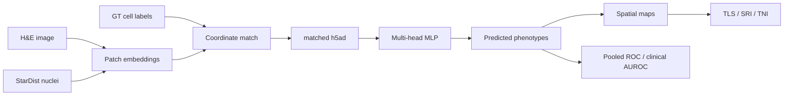

# Hist2Pheno

[](LICENSE)
[](environment.yml)
[](https://pytorch.org/)

**Predict cell phenotypes from H&E histology**, then map those predictions in space.

Hist2Pheno takes per-nucleus H&E patch embeddings (UNI / HIPT / Virchow2), trains a multi-head MLP to multi-tier cell-type labels, validates on independent StarDist nuclei, and supports histology-derived niche indices (TLS / SRI / TNI on CODEX; FRI / ARI / APNB on Xenium).

The **s1167 Pancreas (PDAC) and GIST TMA tracks** are complete end-to-end: match → UNI → h5ad → cross-dataset CV → StarDist inference → pooled ROC / clinical AUROC → TLS / SRI / TNI.

**Xenium BRCA** (10x FFPE breast preview, two neighboring replicates) and **CODEX GBM** (WangLab Visium HD IDH-mutant glioma, Initial / Recurrent) are on the same three-head train / Pred track. They do not yet have clinical niche-index notebooks.

**Xenium CRC** (Oliveira et al., *Nat Genet* 2025: Visium HD + Xenium In Situ on the same FFPE CRC blocks) transfers RCTD `DeconvolutionLabel1` from 8 µm bins onto Xenium cells, then follows the BRCA-style match / UNI / three-head train path for **P1 / P2** (P5 HE is present; labels not transferred yet).

Raw images and embeddings are **not** shipped in this repository. Each dataset folder has its own README and `demo.sh` command index.

## Highlights

- **Shared modeling stack** in [`code/Hist2Pheno_pkg/`](code/Hist2Pheno_pkg/) — matching, AnnData I/O, spatial kNN fusion, training, palettes, CV helpers, and the TLS / SRI / TNI engine
- **Shared embedder** [`code/Image_feature_extraction.py`](code/Image_feature_extraction.py) — per-cell UNI / HIPT / Virchow2 patches from H&E
- **Multi-cohort pipelines** — Xenium lung / BRCA / CRC plus CODEX HCC, ESCC, PDAC, GIST, and GBM
- **StarDist external validation** — train on GT nuclei, evaluate / infer on all segmented nuclei
- **s1167 TMAs done** — PDAC (278 annotated + 195 unlabeled cores) and GIST (550 annotated) share one TMA root but keep separate StarDist trees, pooled weights, and clinical notebooks
- **BRCA / GBM ports** — leave-one-sample-out OOF + all-sample deployment weights when there are fewer sections than folds; Pred statistic notebooks (`xenium_brca`, `codex_gbm`)



## Supported datasets

| Dataset | Folder | Scale | Labels | `pan_organ` | Pipeline |
|---------|--------|-------|--------|-------------|----------|
| Xenium lung fibrosis ([GSE250346](https://www.ncbi.nlm.nih.gov/geo/query/acc.cgi?acc=GSE250346)) | [`code/Xenium_lung/`](code/Xenium_lung/) | 25 Complete + 20 Incomplete | five-head (L2 / L12 / L1 / CNiche / TNiche) | `xenium_lung` | train + niche |
| Xenium BRCA ([Janesick et al., *Nat Commun* 2023](https://www.nature.com/articles/s41467-023-43458-x); [GSE243275](https://www.ncbi.nlm.nih.gov/geo/query/acc.cgi?acc=GSE243275)) | [`code/Xenium_brca/`](code/Xenium_brca/) | 2 neighboring replicates (rep1 / rep2) | three-head (16 L2 / 8 L12 / 4 L1) | `xenium_brca` | train + Pred |
| Xenium CRC ([Oliveira et al., *Nat Genet* 2025](https://www.nature.com/articles/s41588-025-02193-3); [GSE280318](https://www.ncbi.nlm.nih.gov/geo/query/acc.cgi?acc=GSE280318)) | [`code/Xenium_crc/`](code/Xenium_crc/) | P1 / P2 labeled; P5 HE only | three-head (38 L2 / 9 Flex L12 / 4 L1); transferred RCTD Label1 | `xenium_crc` | train |
| CODEX HCC (s4769; [Wu et al., bioRxiv 2025](https://doi.org/10.1101/2025.06.11.656869)) | [`code/CODEX_hcc/`](code/CODEX_hcc/) | 36–38 Visium-aligned HE regions | three-head (L2 / L12 / L1) | `codex_hcc` | train + Pred + niche |
| CODEX ESCC (NCRT cohort) | [`code/CODEX_escc/`](code/CODEX_escc/) | tumor ROIs | five-tier labels | `codex_escc` | train |
| CODEX PDAC (s1167 Pancreas TMA) | [`code/CODEX_pdac/`](code/CODEX_pdac/) | 278 annotated / 195 unlabeled cores | three-head | `codex_pdac` | **full** (train + Pred + niche) |
| CODEX GIST (s1167 GIST TMA) | [`code/CODEX_gist/`](code/CODEX_gist/) | 550 annotated cores | three-head | `codex_gist` | **full** (train + Pred + niche) |
| CODEX GBM ([Tang et al., *Cancer Cell* 2025](https://www.cell.com/cancer-cell/fulltext/S1535-6108(25)00363-0)) | [`code/CODEX_gbm/`](code/CODEX_gbm/) | Initial `P174511` + Recurrent `P179161` | three-head (16 L2 subcluster / 9 L12 SN / 5 L1 cell_type) | `codex_gbm` | train + Pred |

Start from the dataset README, then follow that folder’s `demo.sh`.

## Pan-cancer cell-type labels

A pan-cancer Hist2Pheno (same idea as Fu et al. / Kather et al., *Nat Cancer* 2020: one H&E model across organs) needs a **shared 3-level label space**. Native hierarchies stay as they are; they are mapped onto that space rather than rewritten.

**CODEX ESCC is omitted** (in-house NCRT). The seven public-cohort ground-truth hierarchies:

| Cancer | GT hierarchy (repo-relative) | Sheet | Native L2 / L12 / L1 (train) | GT cells on HE | Native L1 |
|--------|------------------------------|-------|------------------------------|----------------|-----------|
| Lung | [`data/Xemium/weiqin/SpatialPF-NGenetics/Spatial-PF-Processed/Annotation/HE_Annotations/41588_2025_2080_MOESM5_ESM.xlsx`](data/Xemium/weiqin/SpatialPF-NGenetics/Spatial-PF-Processed/Annotation/HE_Annotations/41588_2025_2080_MOESM5_ESM.xlsx) | `Celltype` | 47 / 6 / 4 (+ CNiche 12, TNiche 12) | 637,738 (Complete) | Epithelial, Immune, Endothelial, Mesenchymal |
| BRCA | [`data/Xemium/BRCA/Annotation/GSE243275_Barcode_Cell_Type_MatricesLY.xlsx`](data/Xemium/BRCA/Annotation/GSE243275_Barcode_Cell_Type_MatricesLY.xlsx) | `celltype` | 16 / 8 / 4 | 264,518 | Epithelial, Immune, Stromal, Endothelial |
| CRC | [`data/Xemium/CRC/Annotation/CRC_Barcode_Cell_Type_Matrices.xlsx`](data/Xemium/CRC/Annotation/CRC_Barcode_Cell_Type_Matrices.xlsx) | `celltype` | 38 / 9 Flex / 4 | 364,539 (P1+P2 transferred singlets) | Epithelial, Immune, Stromal, Endothelial (Neuronal folded into Stromal) |
| HCC | [`data/CODEX/HCC/Michael_data_transfer/s4769/HE/s4769_he_mapping_updated_Visium.xlsx`](data/CODEX/HCC/Michael_data_transfer/s4769/HE/s4769_he_mapping_updated_Visium.xlsx) | `Celltype` | 12 / 6 / 4 | 1,095,779 | Epithelial, Immune, Stromal, Endothelial |
| PDAC | [`data/CODEX/HCC/Michael_data_transfer/s1167/raw_metadata_updated.xlsx`](data/CODEX/HCC/Michael_data_transfer/s1167/raw_metadata_updated.xlsx) | `Celltype` (`cohort=Pancreas TMA`) | 11 / 6 / 4 | 1,504,982 | Epithelial, Immune, Stromal, Endothelial |
| GIST | same s1167 workbook | `Celltype` (`cohort=GIST TMA`) | 11 / 6 / 4 | 1,785,460 | Epithelial, Immune, Stromal, Endothelial |
| GBM | [`data/CODEX/GBM/WangLab/3_Annotation_Table/GBM_sc_seg_celltypes_hierarchy.xlsx`](data/CODEX/GBM/WangLab/3_Annotation_Table/GBM_sc_seg_celltypes_hierarchy.xlsx) | `Celltype` | 16 / 9 SN / 5 | 175,210 | Tumor, Myeloid, Lymph, Oligo, Vascular |

Per-cell GT (coordinates + labels) still lives in each dataset’s Cases / Complete_Cases CSVs; the files above are the **multi-level class lists** used at match / train time.

**What agrees.** BRCA / HCC / PDAC / GIST already share a 4-class coarse L1 (Epithelial / Immune / Stromal / Endothelial). Immune L12 is consistently T / B / Myeloid. Stromal vs Endothelial are split the same way.

**What does not.** (1) Lung uses Mesenchymal instead of Stromal, and L12 is tissue-specific (Alveolar / Airway), not T-cell / B-cell. (2) GBM L1 is Tumor / Myeloid / Lymph / Oligo / Vascular; native L12 is **spatial niche SN1–SN9**, not a lineage parent of `subcluster`. (3) GIST “Stromal cells” includes KIT+ tumor (mesenchymal), so it must not be recoded to Epithelial. (4) Fine-name synonyms are rampant (`Helper T cells` = `CD4+_T_Cells` = `CD4 T cells`). (5) CRC native L1 folds Flex Neuronal into Stromal; pan-cancer v1 puts enteric glia on `Neural`. CRC labels are transferred Visium HD RCTD, not Xenium GT.

Shared ontology (one workbook): [`PanCancerCellType.xlsx`](code/Hist2Pheno_pkg/dataset/PanCancerCellType.xlsx). Rebuild: [`build_pancancer_celltype.py`](code/Hist2Pheno_pkg/dataset/build_pancancer_celltype.py).

| Sheet | Contents |
|-------|----------|
| `celltype` | HE-realistic training ontology (**5 L1 / 8 L12 / 20 L2** = 17-class 5-cancer union + 3 coarse lung extras) |
| `celltype_fine` | v0 synonym inventory (5 L1 / 11 L12 / 65 trainable L2) — too fine for H&E |
| `Lung` … `CRC` | Original multi-level rows + v0 `L1/L12/L2` + v1 `L1_v1/L12_v1/L2_v1` |
| `GBM_unique_L2` | GBM collapsed to unique `subcluster` (SN triples stay on `GBM`) |
| `summary` / `Legend` | Paths, native vs unified counts, how to add Prostate |

**v1 L1 (5):** Epithelial · Immune · Stromal · Endothelial · Neural.  
**v1 L12 (8):** Tumor · Epithelial · T_cell · B_Plasma · Myeloid · Stromal · Endothelial · Neural.  
**v1 L2 (20 = 17 core + 3 lung extras).** Core is the BRCA ∪ HCC ∪ PDAC ∪ GIST ∪ GBM union: Tumor, DCIS, Epithelial, Myoepithelial, CD4_T, CD8_T, T_cell, B_cell, Plasma, DC, Macrophage, Macrophage_activated, Neutrophil, Fibroblast, Stromal, Endothelial, Neural. Lung labels that match a core class are merged there (airway → Epithelial, homeostatic FBs → Fibroblast, immune / endothelial synonyms). Lung-only biology is added as three coarse extras — not native-fine: `Alveolar` (AT1+AT2+prolif AT2), `Injury_epithelial` (KRT5-/KRT17++RASC+transitional AT2), `Myofibroblast` (myofibroblast + activated/inflammatory/prolif FBs). Column `l2_scope` on `celltype` marks `core_5union` vs `lung_unique`. **CRC maps onto this 20-class space** (Tumor I–V → `Tumor`, Enterocyte/Goblet/Tuft → `Epithelial`, enteric glia → `Neural`, SM/vSM/CAF → `Stromal`); no new v1 L2. Overlap Venns: [`code/Hist2Pheno_pkg/dataset/L2_overlap_5datasets.ipynb`](code/Hist2Pheno_pkg/dataset/L2_overlap_5datasets.ipynb).

Same rule for Prostate. Cohort class inventories remain in [`Hist2Pheno_Datasets.xlsx`](code/Hist2Pheno_pkg/dataset/Hist2Pheno_Datasets.xlsx).

## Repository layout

```text
Hist2Pheno/
├── code/
│   ├── Hist2Pheno_pkg/          # shared library
│   │   └── dataset/             # Hist2Pheno_Datasets.xlsx + PanCancerCellType.xlsx
│   ├── Image_feature_extraction.py
│   ├── StarDist_nuclei_segmente.py
│   ├── Xenium_lung/
│   ├── Xenium_brca/             # 10x FFPE breast preview (rep1 / rep2)
│   ├── Xenium_crc/              # Oliveira et al. Visium HD + Xenium CRC
│   ├── CODEX_hcc/
│   ├── CODEX_escc/
│   ├── CODEX_pdac/              # s1167 Pancreas TMA (shared mapping + niche engine)
│   ├── CODEX_gist/              # s1167 GIST TMA (thin wrappers + notebooks)
│   └── CODEX_gbm/               # WangLab microscope HE + Visium HD labels
├── environment.yml              # dedicated Hist2Pheno conda env
├── requirements.txt
└── LICENSE
```

Processed data are expected under a local `data/` tree (gitignored). Do not commit `.h5ad`, `.pth`, TIFF, or model weights.

## Installation

```bash
git clone https://github.com/LingyuLi-math/Hist2Pheno.git
cd Hist2Pheno
```

Hist2Pheno was developed in the existing **SeededNTM** conda environment ([LingyuLi-math/SeededNTM](https://github.com/LingyuLi-math/SeededNTM)). This repo now ships a dedicated env of the same stack: Python **3.11**, conda-forge HDF5 / pyarrow / pyproj, then the scientific Python packages in [`requirements.txt`](requirements.txt). Keep **NumPy 1.x** (NumPy 2 breaks some pandas / scanpy combinations used here).

### Option A — create `Hist2Pheno` (recommended for GitHub)

```bash
conda env create -f environment.yml
conda activate Hist2Pheno

# CUDA PyTorch matching your driver (tested: torch 2.9 + CUDA 13.0)
# https://pytorch.org/get-started/locally/
pip install torch torchvision --index-url https://download.pytorch.org/whl/cu128

python -c "import torch; print(torch.__version__, torch.cuda.is_available())"
python -m ipykernel install --user --name Hist2Pheno --display-name "Python (Hist2Pheno)"
```

`cu128` is an example index. Change it if your driver needs another CUDA wheel.

### Option B — clone the existing `SeededNTM` env (this machine)

If `SeededNTM` is already installed and working:

```bash
conda create --name Hist2Pheno --clone SeededNTM
conda activate Hist2Pheno
```

Then run Hist2Pheno with `conda activate Hist2Pheno` (or `conda run -n Hist2Pheno ...`) instead of `SeededNTM`.

UNI / HIPT / Virchow2 **weights are not bundled**. Place them where `Image_feature_extraction.py` expects, or pass the checkpoint path used in your dataset `demo.sh`.

Scripts add `code/Hist2Pheno_pkg` to `sys.path`. For ad-hoc imports:

```bash
export PYTHONPATH="${PWD}/code/Hist2Pheno_pkg:${PYTHONPATH}"
```

### GPU selection

UNI extraction and MLP training use the **first visible** device (`cuda:0` after masking). Pin a physical GPU **before** importing PyTorch:

```bash
export CUDA_VISIBLE_DEVICES=1          # physical GPU 1 → logical cuda:0
```

Training CLIs also accept `--cuda-device 1` when `CUDA_VISIBLE_DEVICES` is unset.  
Matching / h5ad transfer (`transer_embedding_label_h5ad.py`) is CPU.  
Notebooks: set `NCRT_CUDA_DEVICE` **before** `import torch`, then restart the kernel. See [`code/CODEX_gist/README.md`](code/CODEX_gist/README.md) for a worked GPU-pinning example.

## Typical workflow

Every CODEX / Xenium track follows **match → embed → h5ad → train**, then dataset notebooks for CV maps, prediction statistics, and (where available) niche indices. The walkthrough below is PDAC. GIST is the same sequence with `CODEX_gist` and `result_all_spatial_gist`. BRCA / GBM stop after Pred statistic (see below).

```bash
conda activate Hist2Pheno   # or SeededNTM, if you have not cloned the env yet
cd /path/to/Hist2Pheno

# 1. Match GT cells to HE pixels (and StarDist, if annotated)
python -u code/CODEX_pdac/match_codex_cells_with_pixel.py

# 2. Per-nucleus UNI embeddings (GPU)
bash code/CODEX_pdac/demo_UNI_feature_extraction_batch.sh gt
bash code/CODEX_pdac/demo_UNI_feature_extraction_batch.sh stardist

# 3. Write matched / all-nuclei AnnData
python -u code/CODEX_pdac/transer_embedding_label_h5ad.py --steps he_h5ad
python -u code/CODEX_pdac/transer_embedding_label_h5ad.py --steps stardist_h5ad stardist_all_h5ad

# 4. Cross-dataset train + StarDist inference (GPU)
python -u code/CODEX_pdac/PDAC_train_validate_cv_UNIlabel.py \
  --mode cross-dataset \
  --use-spatial-context --spatial-k 8 --spatial-mode mean \
  --pooled-save-result result_all_spatial_pdac

# 5. Interactive CV / spatial maps (default: load CLI weights, do not retrain)
#    open PDAC_train_validate_cv_UNIlabel_all.ipynb

# 6. Histology-derived niche index (TLS / SRI / TNI on matched StarDist)
#    open PDAC_histology_derived_niche_index.ipynb

# 7. Pooled ROC + per-core macro AUROC vs clinical groups
#    open Pred_statistic_visual_pdac_all.ipynb
```

GIST analog: `GIST_train_validate_cv_UNIlabel.py --pooled-save-result result_all_spatial_gist`, then [`GIST_histology_derived_niche_index.ipynb`](code/CODEX_gist/GIST_histology_derived_niche_index.ipynb) and [`Pred_statistic_visual_gist_all.ipynb`](code/CODEX_gist/Pred_statistic_visual_gist_all.ipynb).

CLI default ablation tag is **`D_emph_L2`** even with `--use-spatial-context`. BRCA / GBM demos use **`D_emph_L2_spatial_brca`** / **`D_emph_L2_spatial_gbm`**. Notebooks must use the same tag (`SKIP_POOLED_TRAIN=True` loads `best_mlp_gpu.pt` without retraining or refitting).  
When pooled group CV has **fewer sections than `--cv-k`** (or each fold trains on a single section), OOF stays leave-one-section-out and **`best_mlp_gpu.pt` is refit on all samples** for StarDist / new sections.  
h5ad builders skip a sample when the cache is valid; pass `--force-rebuild` to overwrite. Pooled StarDist validation needs `--steps stardist_h5ad`, not only `stardist_all_h5ad`.

Full command lists: [`code/Xenium_lung/demo.sh`](code/Xenium_lung/demo.sh), [`code/Xenium_brca/demo.sh`](code/Xenium_brca/demo.sh), [`code/Xenium_crc/demo.sh`](code/Xenium_crc/demo.sh), [`code/CODEX_hcc/demo.sh`](code/CODEX_hcc/demo.sh), [`code/CODEX_pdac/demo.sh`](code/CODEX_pdac/demo.sh), [`code/CODEX_gist/demo.sh`](code/CODEX_gist/demo.sh), [`code/CODEX_gbm/demo.sh`](code/CODEX_gbm/demo.sh), [`code/CODEX_escc/demo.sh`](code/CODEX_escc/demo.sh). CRC: [`demo.sh`](code/Xenium_crc/demo.sh) + [`code/Xenium_crc/README.md`](code/Xenium_crc/README.md).

### Prediction heads

| Head | Role | Typical column |
|------|------|----------------|
| L2 | Fine cell type | `final_CT` |
| L12 | Intermediate / sublineage | `final_sublineage` |
| L1 | Coarse lineage | `final_lineage` |
| L3 / L4 | CNiche / TNiche (Xenium) or ESCC coarse / lineage-bucket | dataset-specific |

Xenium lung uses all five heads. HCC / PDAC / GIST / BRCA / GBM / CRC use L2 + L12 + L1. On GBM those heads are **subcluster / spatial_niche (SN1–SN9) / cell_type**, not a copy of L1. On CRC they are **Flex Level2 / Flex 9-class Level1 / 4-class coarse L1** (transferred RCTD Label1). Palettes live in [`plotting_palettes.py`](code/Hist2Pheno_pkg/plotting_palettes.py); see the [package README](code/Hist2Pheno_pkg/README.md). Cohort class lists: [`Hist2Pheno_Datasets.xlsx`](code/Hist2Pheno_pkg/dataset/Hist2Pheno_Datasets.xlsx). Shared pan-cancer ontology (seven public cohorts in the workbook; ESCC excluded): [`PanCancerCellType.xlsx`](code/Hist2Pheno_pkg/dataset/PanCancerCellType.xlsx) sheet `celltype` (5 / 8 / 20; fine inventory is sheet `celltype_fine`).

## CODEX PDAC and GIST (s1167 TMA)

Both cohorts live under the same TMA root (`data/CODEX/HCC/Michael_data_transfer/s1167/`) and share [`s1167_img_cell_mapping.py`](code/CODEX_pdac/s1167_img_cell_mapping.py). They are **separate Hist2Pheno tracks**: do not mix StarDist folders, pooled result directories, or niche-index kernels.

| | PDAC | GIST |
|--|------|------|
| Folder | [`code/CODEX_pdac/`](code/CODEX_pdac/) | [`code/CODEX_gist/`](code/CODEX_gist/) |
| Cores | 473 (278 annotated + 195 unlabeled) | 550 (all annotated) |
| Coverslips | `c001`, `c003`, `c005`, `c007` | `c009`, `c011`, `c013` |
| StarDist | `StarDist_Segment_pdac/` | `StarDist_Segment_gist/` |
| Pooled outputs | `s1167/result_all_spatial_pdac/` | `s1167/result_all_spatial_gist/` |
| Train / infer | Train 278; infer unlabeled → `stardist_Incomplete_Cases/` | Train + infer all 550; no Incomplete_Cases |
| Pred notebook | `Pred_statistic_visual_pdac_all.ipynb` | `Pred_statistic_visual_gist_all.ipynb` |
| Niche notebook | `PDAC_histology_derived_niche_index.ipynb` | `GIST_histology_derived_niche_index.ipynb` |
| Clinical groups | coverslip, `SAMPLE_LABEL` | coverslip plus recoded `site` / `size` / mitotic / mutation / risk / primary / `tma_block` |
| Niche wrapper | `pdac_histology_derived_niche_index.py` | `gist_histology_derived_niche_index.py` |

Shared niche engine: [`s1167_histology_derived_niche_index.py`](code/CODEX_pdac/s1167_histology_derived_niche_index.py) (`configure("codex_pdac")` or `configure("codex_gist")`) on top of [`histology_niche_index.py`](code/Hist2Pheno_pkg/histology_niche_index.py). **Do not import both wrappers in one kernel** — `configure()` is global.

GIST Pred and clinical recoding (`recode_gist_tma_clinical`) live in **[`code/CODEX_pdac/s1167_plot.py`](code/CODEX_pdac/s1167_plot.py)**. Do not switch those notebooks to the GIST-folder `s1167_plot.py`.

Neither TMA has immunotherapy **Response**. TNI myeloid = Macrophages (GIST also counts Monocytes); endothelium includes lymphatic endothelial cells on GIST. Niche §6 defaults to `QUICK_VALIDATE=True` (six cores); set `False` for the full cohort.

Outputs under `s1167/`:

| | PDAC | GIST |
|--|------|------|
| Weights | `result_all_spatial_pdac/cross_dataset_cv/D_emph_L2/best_mlp_gpu.pt` | `result_all_spatial_gist/cross_dataset_cv/D_emph_L2/best_mlp_gpu.pt` |
| Niche | `result_all_spatial_pdac/niche_index_pdac/` | `result_all_spatial_gist/niche_index_gist/` |
| Clinical viz | `result_all_spatial_pdac/clinical_viz_pdac/` | `result_all_spatial_gist/clinical_viz_gist/` |

## Xenium BRCA and CODEX GBM

These two ports reuse the HCC-style **three-head** CLI + `_single` / `_all` notebooks + Pred statistic. Cross-dataset **OOF** is leave-one-sample-out (two samples each). Because `n_sections < cv_k`, **`best_mlp_gpu.pt` is then refit on all cells** (LORO fold kept as `best_mlp_gpu_loro.pt`) so StarDist and new sections see every class. `_all` notebooks with `SKIP_POOLED_TRAIN=True` only **load** that checkpoint. UNI / train jobs are large; pin a GPU and do not launch them accidentally. There is **no** clinical niche-index notebook yet (no Response / coverslip-style groups).

| | Xenium BRCA | CODEX GBM |
|--|-------------|-----------|
| Folder | [`code/Xenium_brca/`](code/Xenium_brca/) | [`code/CODEX_gbm/`](code/CODEX_gbm/) |
| Samples | `rep1`, `rep2` (neighboring FFPE slices) | `P174511_Initial`, `P179161_Recurrent` |
| Labels | 16 L2 / 8 L12 / 4 L1 (`Unlabeled` + 3 red L2 dropped) | L2=`subcluster` (16), L12=`spatial_niche` SN1–SN9 (9), L1=`cell_type` (5); drop `Unknown` / `LowQ` / SN LowQ |
| Trainable nuclei | 157k + 107k on HE; StarDist-matched 147k + 98k | 37,371 Ini + 137,839 Rec after filters |
| Coordinates | Explorer `*_he_imagealignment.csv` → OME HE → working `*_he_image.tif`; UNI `--scale` ≈ 0.84 | `loc.csv` already on microscope HE pixels (no affine); UNI `scale_image=False` |
| Pooled outputs | `data/Xemium/BRCA/Results/result_all_spatial/` | `data/CODEX/GBM/Results/result_all_spatial/` |
| Ablation tag | `D_emph_L2_spatial_brca` | `D_emph_L2_spatial_gbm` |
| Pred notebook | `Pred_statistic_visual_brca_all.ipynb` (rep1 vs rep2) | `Pred_statistic_visual_gbm_all.ipynb` (Initial vs Recurrent) |

The GBM folder is named CODEX for pipeline layout; the images are **microscope HE**, not CODEX. BRCA’s on-disk root is `data/Xemium/BRCA/` (historical spelling).

## Xenium CRC (Visium HD companion)

Oliveira et al. (*Nat Genet* 2025) profiled FFPE CRC with **Visium HD** (2 µm capture, analyzed at 8 µm) and validated a subset with **Xenium In Situ**. Hist2Pheno keeps both: RCTD deconvolution on Visium HD bins, then nearest-bin transfer onto Xenium cells (the alignment CSVs have centroids, not cell types).

P1/P2 are on the BRCA-style **three-head** path (match → UNI → `CRC_train_validate_cv_UNIlabel.py`). P5 has HE + alignment only so far (no annotation sheet / Cases / StarDist). Labels remain **transferred RCTD singlet**, not native Xenium GT. There is no Pred statistic notebook yet.

| | |
|--|--|
| Folder | [`code/Xenium_crc/`](code/Xenium_crc/) |
| Notebook | [`Data_process_HEcelltype_CRC.ipynb`](code/Xenium_crc/Data_process_HEcelltype_CRC.ipynb) |
| Patients | `P1CRC`, `P2CRC` labeled; `P5CRC` HE only |
| Cell type | `DeconvolutionLabel1` (RCTD first type = Flex **Level2**, 38 classes). `DeconvolutionLabel2` is ignored. Train L12 = Flex 9-class Level1; L1 = 4 coarse parents (Neuronal → Stromal) |
| Transferred cells on HE | 154,760 (P1) + 209,779 (P2) = **364,539**; StarDist-matched 96,858 + 166,503 |
| Visium HD bins | `P{1,2,5}CRC_Metadata.parquet` (on-tissue ~508k / 546k / 542k; RCTD-assigned 311k / 431k / 392k) |
| Xenium cells | 1.12M / 1.11M / 1.03M; ~24–29% fall in the Visium capture bbox and map at median **~3.2 µm** (one 8 µm bin) |
| Visium HD data | `data/VisiumHD/CRC/P{1,2,5}_CRC/` ([10x CRC dataset](https://www.10xgenomics.com/products/visium-hd-spatial-gene-expression/dataset-human-crc); GEO [GSE280318](https://www.ncbi.nlm.nih.gov/geo/query/acc.cgi?acc=GSE280318)) |
| Xenium alignment | `data/Xemium/CRC/Xenium_Visium_Alignment/Xenium_P{1,2,5}_cell_info.csv` |
| Hierarchy xlsx | [`data/Xemium/CRC/Annotation/CRC_Barcode_Cell_Type_Matrices.xlsx`](data/Xemium/CRC/Annotation/CRC_Barcode_Cell_Type_Matrices.xlsx) |
| Paper metadata | [`code/Xenium_crc/HumanColonCancer_VisiumHD/`](code/Xenium_crc/HumanColonCancer_VisiumHD/) (clone of [10XGenomics/HumanColonCancer_VisiumHD](https://github.com/10XGenomics/HumanColonCancer_VisiumHD); Hist2Pheno uses `SingleCell_MetaData_2025.csv`) |

Do not mix Visium HD 8 µm bin coordinates with Xenium HE pixels without the paper alignment tables.

## Data

This repo tracks **code only**. Point each pipeline at your local copy:

| Project | Local layout (example) | GT cell-type hierarchy | Notes |
|---------|------------------------|------------------------|--------|
| Xenium lung | `Spatial-PF-Processed/Data/{Complete,Incomplete}_Cases/` | `Annotation/HE_Annotations/41588_2025_2080_MOESM5_ESM.xlsx` sheet `Celltype` | [GSE250346](https://www.ncbi.nlm.nih.gov/geo/query/acc.cgi?acc=GSE250346); see [`code/Xenium_lung/README.md`](code/Xenium_lung/README.md) |
| Xenium BRCA | `data/Xemium/BRCA/` | `Annotation/GSE243275_Barcode_Cell_Type_MatricesLY.xlsx` sheet `celltype` | [Janesick et al., *Nat Commun* 2023](https://www.nature.com/articles/s41467-023-43458-x); 10x FFPE Human Breast Cancer preview + [GSE243275](https://www.ncbi.nlm.nih.gov/geo/query/acc.cgi?acc=GSE243275); see [`code/Xenium_brca/README.md`](code/Xenium_brca/README.md) |
| Xenium CRC | `data/Xemium/CRC/` (Xenium) + `data/VisiumHD/CRC/` (Visium HD) | `Annotation/CRC_Barcode_Cell_Type_Matrices.xlsx` sheet `celltype` (transferred RCTD Label1) | [Oliveira et al., *Nat Genet* 2025](https://www.nature.com/articles/s41588-025-02193-3); [10x Visium HD CRC](https://www.10xgenomics.com/products/visium-hd-spatial-gene-expression/dataset-human-crc); GEO [GSE280318](https://www.ncbi.nlm.nih.gov/geo/query/acc.cgi?acc=GSE280318); see [`code/Xenium_crc/README.md`](code/Xenium_crc/README.md) and [`data/VisiumHD/README.md`](data/VisiumHD/README.md) |
| CODEX HCC | `data/CODEX/HCC/Michael_data_transfer/s4769/` | `HE/s4769_he_mapping_updated_Visium.xlsx` sheet `Celltype` | Visium-aligned HE + CODEX; [Wu et al., bioRxiv 2025](https://doi.org/10.1101/2025.06.11.656869), processed data on [Zenodo](https://doi.org/10.5281/zenodo.15392699) |
| CODEX PDAC / GIST | `data/CODEX/HCC/Michael_data_transfer/s1167/` | `raw_metadata_updated.xlsx` sheet `Celltype` (split by `cohort`) | Same TMA root; split by coverslip (`c001`–`c007` PDAC, `c009`–`c013` GIST). Metadata: sheet `Clinical_info` |
| CODEX GBM | `data/CODEX/GBM/WangLab/` | `3_Annotation_Table/GBM_sc_seg_celltypes_hierarchy.xlsx` sheet `Celltype` | [Tang et al., *Cancer Cell* 2025](https://www.cell.com/cancer-cell/fulltext/S1535-6108(25)00363-0); microscope HE + single-nucleus labels; Cases / Results under `data/CODEX/GBM/` |
| CODEX ESCC | `data/CODEX/ESCC/` | in-house (`codex_meta_celltype_*.csv`); **not** in the pan-cancer ontology | NCRT remains the cohort path name |

Unified mapping across the seven public cohorts in the workbook: [`PanCancerCellType.xlsx`](code/Hist2Pheno_pkg/dataset/PanCancerCellType.xlsx) (`celltype` for training, `celltype_fine` for the fine synonym list). CRC Flex Label1 is mapped onto the existing 20-class v1 L2 (no new heads).

## Citation

If you use this code, please cite the associated publication (TBD) and the source datasets:

- **CODEX HCC** — Wu Z, Boen J, Jindal S, et al. Spatial multi-omics and deep learning reveal fingerprints of immunotherapy response and resistance in hepatocellular carcinoma. *bioRxiv* (2025). [doi:10.1101/2025.06.11.656869](https://doi.org/10.1101/2025.06.11.656869). Processed CODEX / Visium / co-registered H&E: [Zenodo](https://doi.org/10.5281/zenodo.15392699).
- **Xenium lung** — Kedlian et al., spatial multi-omics lung fibrosis atlas ([GSE250346](https://www.ncbi.nlm.nih.gov/geo/query/acc.cgi?acc=GSE250346)).
- **Xenium BRCA** — Janesick A, Shelansky R, Gottscho AD, et al. High resolution mapping of the tumor microenvironment using integrated single-cell, spatial and in situ analysis. *Nat Commun* **14**, 8353 (2023). [doi:10.1038/s41467-023-43458-x](https://www.nature.com/articles/s41467-023-43458-x). GEO: [GSE243275](https://www.ncbi.nlm.nih.gov/geo/query/acc.cgi?acc=GSE243275).
- **Xenium CRC / Visium HD** — Oliveira MF, Romero JP, Chung M, et al. High-definition spatial transcriptomic profiling of immune cell populations in colorectal cancer. *Nat Genet* **57**, 1512–1523 (2025). [doi:10.1038/s41588-025-02193-3](https://www.nature.com/articles/s41588-025-02193-3). GEO: [GSE280318](https://www.ncbi.nlm.nih.gov/geo/query/acc.cgi?acc=GSE280318). 10x: [Visium HD Human CRC](https://www.10xgenomics.com/products/visium-hd-spatial-gene-expression/dataset-human-crc).
- **CODEX GBM** — Tang J, Fan W, Ruan Y, et al. Protein-based classification reveals an immune-hot subtype in IDH mutant astrocytoma with worse prognosis. *Cancer Cell* (2025). [doi:10.1016/j.ccell.2025.08.006](https://www.cell.com/cancer-cell/fulltext/S1535-6108(25)00363-0).
- **Pan-cancer H&E (design refs)** — Fu Y, Jung AW, Torne RV, et al. Pan-cancer computational histopathology reveals mutations, tumor composition and prognosis. *Nat Cancer* **1**, 800–810 (2020). [doi:10.1038/s43018-020-0085-8](https://doi.org/10.1038/s43018-020-0085-8). Kather JN, Heij LR, Grabsch HI, et al. Pan-cancer image-based detection of clinically actionable genetic alterations. *Nat Cancer* **1**, 789–799 (2020). [doi:10.1038/s43018-020-0087-6](https://doi.org/10.1038/s43018-020-0087-6).

## License

Apache-2.0. See [LICENSE](LICENSE).

Foundation-model checkpoints (UNI, HIPT, Virchow2) keep their original licenses and must be obtained separately.
