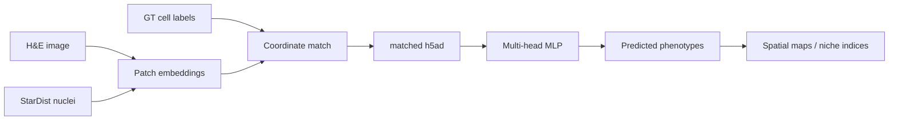

# Hist2Pheno

[](LICENSE)
[](requirements.txt)
[](https://pytorch.org/)

**Predict cell phenotypes from H&E histology**, then map those predictions in space.

Hist2Pheno takes per-nucleus H&E patch embeddings (UNI / HIPT / Virchow2), trains a multi-head MLP to multi-tier cell-type labels, validates on independent StarDist nuclei, and supports histology-derived niche indices (TLS, FRI, ARI, APNB).

Raw images and embeddings are **not** shipped in this repository. Each dataset folder has its own README and `demo.sh` command index.

## Highlights

- **Shared modeling stack** in [`code/Hist2Pheno_pkg/`](code/Hist2Pheno_pkg/) — matching, AnnData I/O, spatial kNN fusion, training, palettes, and CV helpers
- **Shared embedder** [`code/Image_feature_extraction.py`](code/Image_feature_extraction.py) — per-cell UNI / HIPT / Virchow2 patches from H&E
- **Multi-cohort pipelines** — Xenium lung fibrosis plus CODEX HCC, ESCC, PDAC, and GIST
- **StarDist external validation** — train on GT nuclei, evaluate / infer on all segmented nuclei



## Supported datasets

| Dataset | Folder | Scale | Labels | `pan_organ` |
|---------|--------|-------|--------|-------------|
| Xenium lung fibrosis ([GSE250346](https://www.ncbi.nlm.nih.gov/geo/query/acc.cgi?acc=GSE250346)) | [`code/Xenium_lung/`](code/Xenium_lung/) | 25 Complete + 20 Incomplete | five-head (L2 / L12 / L1 / CNiche / TNiche) | `xenium_lung` |
| CODEX HCC (s4769) | [`code/CODEX_hcc/`](code/CODEX_hcc/) | 36–38 Visium-aligned HE regions | three-head (L2 / L12 / L1) | `codex_hcc` |
| CODEX ESCC (NCRT cohort) | [`code/CODEX_escc/`](code/CODEX_escc/) | tumor ROIs | five-tier labels | `codex_escc` |
| CODEX PDAC (s1167 Pancreas TMA) | [`code/CODEX_pdac/`](code/CODEX_pdac/) | 278 annotated / 195 unlabeled cores | three-head | `codex_pdac` |
| CODEX GIST (s1167 GIST TMA) | [`code/CODEX_gist/`](code/CODEX_gist/) | 550 annotated cores | three-head | `codex_gist` |

Start from the dataset README, then follow that folder’s `demo.sh`.

## Repository layout

```text
Hist2Pheno/
├── code/
│   ├── Hist2Pheno_pkg/          # shared library
│   ├── Image_feature_extraction.py
│   ├── StarDist_nuclei_segmente.py
│   ├── Xenium_lung/
│   ├── CODEX_hcc/
│   ├── CODEX_escc/
│   ├── CODEX_pdac/
│   └── CODEX_gist/
├── requirements.txt
└── LICENSE
```

Processed data are expected under a local `data/` tree (gitignored). Do not commit `.h5ad`, `.pth`, TIFF, or model weights.

## Installation

```bash
git clone https://github.com/LingyuLi-math/Hist2Pheno.git
cd Hist2Pheno
```

Use a CUDA-enabled PyTorch environment. The development env is named `SeededNTM`; a fresh install can start from:

```bash
conda create -n Hist2Pheno python=3.10
conda activate Hist2Pheno
pip install -r requirements.txt
# install a CUDA PyTorch build that matches your driver:
# https://pytorch.org/get-started/locally/
```

UNI / HIPT / Virchow2 **weights are not bundled**. Place them where `Image_feature_extraction.py` expects, or pass the checkpoint path used in your dataset `demo.sh`.

Scripts add `code/Hist2Pheno_pkg` to `sys.path`. For ad-hoc imports:

```bash
export PYTHONPATH="${PWD}/code/Hist2Pheno_pkg:${PYTHONPATH}"
```

### GPU selection

UNI extraction and MLP training use the **first visible** device (`cuda:0` after masking). Pin a physical GPU **before** importing PyTorch:

```bash
export CUDA_VISIBLE_DEVICES=1          # physical GPU 1 → logical cuda:0
```

Training CLIs also accept `--cuda-device 1` when `CUDA_VISIBLE_DEVICES` is unset.  
Matching / h5ad transfer (`transer_embedding_label_h5ad.py`) is CPU.  
Notebooks: set `NCRT_CUDA_DEVICE` **before** `import torch`, then restart the kernel. See [`code/CODEX_gist/README.md`](code/CODEX_gist/README.md) for a worked GPU-pinning example.

## Typical workflow

Every CODEX / Xenium track follows the same five stages. Replace `CODEX_pdac` with the dataset folder you need.

```bash
conda activate SeededNTM   # or Hist2Pheno
cd /path/to/Hist2Pheno

# 1. Match GT cells to HE pixels (and StarDist, if annotated)
python -u code/CODEX_pdac/match_codex_cells_with_pixel.py

# 2. Per-nucleus UNI embeddings (GPU)
bash code/CODEX_pdac/demo_UNI_feature_extraction_batch.sh gt
bash code/CODEX_pdac/demo_UNI_feature_extraction_batch.sh stardist

# 3. Write matched / all-nuclei AnnData
python -u code/CODEX_pdac/transer_embedding_label_h5ad.py --steps he_h5ad
python -u code/CODEX_pdac/transer_embedding_label_h5ad.py --steps stardist_all_h5ad

# 4. Cross-dataset train + StarDist inference (GPU)
python -u code/CODEX_pdac/PDAC_train_validate_cv_UNIlabel.py \
  --mode cross-dataset \
  --use-spatial-context --spatial-k 8 --spatial-mode mean \
  --pooled-save-result result_all_spatial

# 5. Interactive CV / spatial maps
#    open the dataset *_train_validate_cv_UNIlabel_all.ipynb
```

h5ad builders skip a sample when the cache is valid; pass `--force-rebuild` to overwrite.  
Full command lists: [`code/Xenium_lung/demo.sh`](code/Xenium_lung/demo.sh), [`code/CODEX_hcc/demo.sh`](code/CODEX_hcc/demo.sh), [`code/CODEX_pdac/demo.sh`](code/CODEX_pdac/demo.sh), [`code/CODEX_gist/demo.sh`](code/CODEX_gist/demo.sh), [`code/CODEX_escc/demo.sh`](code/CODEX_escc/demo.sh).

### Prediction heads

| Head | Role | Typical column |
|------|------|----------------|
| L2 | Fine cell type | `final_CT` |
| L12 | Intermediate / sublineage | `final_sublineage` |
| L1 | Coarse lineage | `final_lineage` |
| L3 / L4 | CNiche / TNiche (Xenium) or ESCC coarse / lineage-bucket | dataset-specific |

Xenium uses all five heads. HCC / PDAC / GIST use L2 + L12 + L1. Palettes live in [`plotting_palettes.py`](code/Hist2Pheno_pkg/plotting_palettes.py); see the [package README](code/Hist2Pheno_pkg/README.md).

## Data

This repo tracks **code only**. Point each pipeline at your local copy:

| Project | Local layout (example) | Notes |
|---------|------------------------|--------|
| Xenium lung | `Spatial-PF-Processed/Data/{Complete,Incomplete}_Cases/` | [GSE250346](https://www.ncbi.nlm.nih.gov/geo/query/acc.cgi?acc=GSE250346); see [`code/Xenium_lung/README.md`](code/Xenium_lung/README.md) |
| CODEX HCC | `data/CODEX/HCC/Michael_data_transfer/s4769/` | Visium-aligned HE + CODEX cell tables |
| CODEX PDAC / GIST | `data/CODEX/HCC/Michael_data_transfer/s1167/` | Same TMA root; split by coverslip (`c001`–`c007` PDAC, `c009`–`c013` GIST) |
| CODEX ESCC | `data/CODEX/ESCC/` | NCRT remains the cohort path name |

## Citation

If you use this code, please cite the associated publication (TBD) and the source datasets, including:

> Kedlian et al., spatial multi-omics lung fibrosis atlas ([GSE250346](https://www.ncbi.nlm.nih.gov/geo/query/acc.cgi?acc=GSE250346)).

## License

Apache-2.0. See [LICENSE](LICENSE).

Foundation-model checkpoints (UNI, HIPT, Virchow2) keep their original licenses and must be obtained separately.
