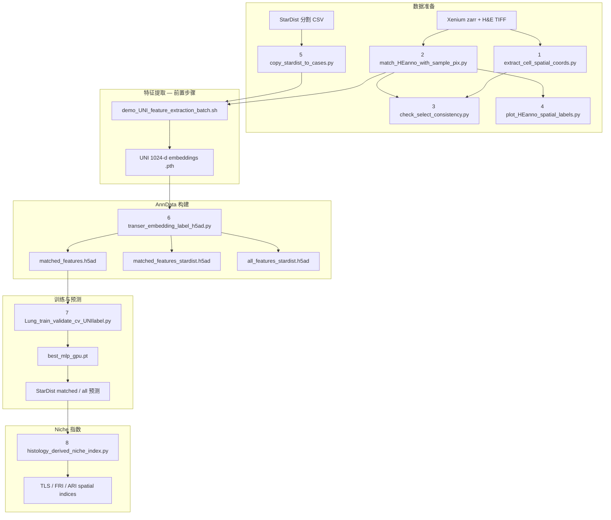

# Xenium Lung — 从 H&E 到 Cell Niche 的完整流程

本目录包含 **GSE250346 肺纤维化 Xenium 数据集**（Weiqin 预处理版）的分析流水线：从 Xenium / H&E 空间坐标对齐、UNI 特征提取、五层细胞类型预测，到基于组织学预测概率的 **cell niche 指数**（TLS、FRI、ARI 等）。

核心建模与可视化依赖 [`../Hist2Pheno_pkg/`](../Hist2Pheno_pkg/)（`base.py` / `model.py` / `plot.py`），本目录脚本负责 Xenium lung 特有的路径、样本映射与批处理封装。

---

## 目录

1. [环境与依赖](#环境与依赖)
2. [Data 目录说明](#data-目录说明)
3. [流程总览](#流程总览)
4. [分步详解](#分步详解)
5. [Hist2Pheno_pkg 角色](#hist2pheno_pkg-角色)
6. [模型训练与验证](#模型训练与验证)
7. [Cell niche 下游分析](#cell-niche-下游分析)
8. [Notebook 与辅助脚本](#notebook-与辅助脚本)
9. [常见问题](#常见问题)

---

## 环境与依赖

| 项目 | 说明 |
|------|------|
| Conda 环境 | `SeededNTM`（含 PyTorch、scanpy、spatialdata 等） |
| 工作目录 | 仓库根目录 `esccAI/` |
| GPU | UNI 特征提取与 MLP 训练建议使用 CUDA |
| Python 路径 | 脚本会自动把 `code/Hist2Pheno_pkg` 加入 `sys.path` |

```bash
cd /home/lingyu/ssd2/Python/Collaborate/esccAI
conda activate SeededNTM
```

长任务建议使用 `python -u` 或 `conda run --no-capture-output`，以便实时看到日志。

---

## Data 目录说明

所有 Xenium lung 数据位于：

```
data/Xemiun/weiqin/SpatialPF-NGenetics/Spatial-PF-Processed/
├── Annotation/                          # 论文级注释与元数据
│   ├── HE_Annotations/                  # 病理 H&E 细胞注释 CSV / xlsx
│   └── Niche_Cell_Annotations/           # Niche 相关注释
├── GSE250346_README.txt                  # 原始 GSE250346 数据说明
└── Data/
    ├── Complete_Cases/                   # 25 个完整样本（有 zarr + 注释 + 训练用）
    ├── Incomplete_Cases/                 # 20 个不完整样本（通常无 data.zarr）
    ├── Complete_Cases_Select4/           # 早期调试用的 4 样本子集
    ├── Complete_Cases_remove/            # 从 Complete 移出的合并大样本
    ├── result/                           # 默认 per-sample / 早期 pooled 结果
    ├── result_all_spatial/               # cross-dataset + spatial context 主结果
    └── ...
```

### 样本集合

| 集合 | 数量 | 用途 |
|------|------|------|
| `Complete_Cases` | 25 | 训练、内部验证、StarDist 外部验证、niche 分析 |
| `Incomplete_Cases` | 20 | 可选特征提取 / 可视化；**无 zarr，无法跑 step 1** |
| `Complete_Cases_Select4` | 4 | `VUHD113`, `VUILD107MA`, `VUILD102LA`, `VUILD96LA` 快速测试 |

论文 Sample ID（如 `VUILD107MA`）与 Weiqin HE 注释 ID（如 `VUILD107MF`）的映射见 [`sample_mapping.py`](sample_mapping.py) 中的 `PAPER_TO_WEIQIN`。

### 单个样本目录结构（以 `VUILD107MA` 为例）

```
Complete_Cases/VUILD107MA/
├── data.zarr                             # Xenium SpatialData（step 1 输入）
├── VUILD107MA-HE.tif                     # 配准后的 H&E 全切片
├── VUILD107MA-HE_lowres.jpg              # 低分辨率预览
├── VUILD107MA_spatial_coords_um_pix_from_zarr.csv   # step 1 输出
├── VUILD107MA_cells_partitioned_by_annotation_sample_match_with_pixel.csv  # step 2
├── VUILD107MA_Float_prob0.01_nms_0.3.csv # StarDist 核分割（step 5 拷贝）
├── VUILD107MA_project_all_UNI/           # UNI 特征（见下方）
│   ├── ImgEmbeddings_all/                #   GT 细胞坐标 → UNI embedding (.pth)
│   └── ImgEmbeddings_all_stardist/       #   StarDist 坐标 → UNI embedding
├── VUILD107MA_matched_features.h5ad              # step 6：HE/GT matched
├── VUILD107MA_cells_matched_by_stardist.csv      # step 6：Xenium↔StarDist 匹配表
├── VUILD107MA_matched_features_stardist.h5ad     # step 6：StarDist matched（有 GT）
├── VUILD107MA_all_features_stardist.h5ad         # step 6：全部 StarDist 核（无 GT）
└── VUILD107MA_project_all_UNI/result/            # per-sample 训练输出（step 7）
```

### Cross-dataset 结果目录（`Data/result_all_spatial/`）

```
result_all_spatial/
├── cross_dataset_cv/D_emph_L2_spatial_bs4096/
│   └── best_mlp_gpu.pt                   # 25 样本 pooled 训练的最佳 checkpoint
├── validation_internal_metrics.csv
├── validation_external_stardist_matched_AUROC_all_samples_concat.csv
└── stardist/{sample}/                    # 各样本 StarDist 预测与验证
    ├── validation_external_stardist_matched_AUROC.csv      # matched 核 + prob_*（有 GT）
    ├── validation_external_stardist_matched_metrics.csv
    └── {sample}_all_features_stardist_label.h5ad         # 全部 StarDist 核五头概率
```

### 细胞类型层级（五头 MLP）

模型同时预测五个 annotation tier（来自 MOESM5 `Celltype` sheet）：

| Head | 含义 | 典型列名 |
|------|------|----------|
| L2 | 精细 cell type（`final_CT`） | `class_names` |
| L1 | Lineage（Epithelial / Immune / …） | `class_names_level1` |
| L12 | Level 1-1-2 | `class_names_level12` |
| L3 | CNiche（C1–C12） | `class_names_level3` |
| L4 | TNiche（T1–T12） | `class_names_level4` |

---

## 流程总览

`demo.sh` 中定义的脚本顺序（括号内为实际文件名）：



> **说明：** UNI 特征提取由 [`demo_UNI_feature_extraction_batch.sh`](demo_UNI_feature_extraction_batch.sh) 调用仓库根目录的 `code/Image_feature_extraction.py`，在 `demo.sh` 编号中作为 step 5→6 之间的必要前置步骤。StarDist 分割本身在本仓库外完成（结果放在 `data/Xenium/lung/StarDist_Segment/`）。

---

## 分步详解

以下命令均从仓库根目录运行。

### Step 0（外部）：StarDist 核分割

- **输入：** `{sample}-HE.tif`
- **输出：** `data/Xenium/lung/StarDist_Segment/{sample}/{sample}_Float_prob0.01_nms_0.3.csv`
- 列含 `centroid_x`, `centroid_y`, `probability` 等（HE 像素坐标）

### Step 1 — 提取 Xenium 空间坐标

**脚本：** [`extract_cell_spatial_coords.py`](extract_cell_spatial_coords.py)

从每个样本的 `data.zarr` 读取 cell / nucleus 边界与质心（μm），并转换为 H&E 像素坐标。

```bash
# 默认 Complete_Cases_Select4
conda run -n SeededNTM python code/Xenium_lung/extract_cell_spatial_coords.py

# 全部 Complete_Cases（25 样本）
conda run -n SeededNTM python code/Xenium_lung/extract_cell_spatial_coords.py \
  --data-dir data/Xemiun/weiqin/SpatialPF-NGenetics/Spatial-PF-Processed/Data/Complete_Cases
```

| 输出 | 路径 |
|------|------|
| 单样本 | `{sample}/{sample}_spatial_coords_um_pix_from_zarr.csv` |
| 合并 | `Complete_Cases/Cell_spatial_coords_um_pix_from_zarr_all.csv` |

### Step 2 — 匹配 HE 注释与样本 ID

**脚本：** [`match_HEanno_with_sample_pix.py`](match_HEanno_with_sample_pix.py)

将 Weiqin 全局 HE 注释表与论文 Sample ID 对齐，写入每个 case 目录。

```bash
conda run -n SeededNTM python code/Xenium_lung/match_HEanno_with_sample_pix.py \
  --cases-dir data/Xemiun/weiqin/SpatialPF-NGenetics/Spatial-PF-Processed/Data/Complete_Cases
```

| 输出 | 路径 |
|------|------|
| 全局 | `Annotation/HE_Annotations/cells_partitioned_by_annotation_sample_match_with_pixel.csv` |
| 单样本 | `{sample}/{sample}_cells_partitioned_by_annotation_sample_match_with_pixel.csv` |

### Step 3 — 坐标一致性检查

**脚本：** [`check_select_consistency.py`](check_select_consistency.py)

对比 zarr 质心与 HE 注释质心是否一致（QC）。

```bash
conda run -n SeededNTM python code/Xenium_lung/check_select_consistency.py
conda run -n SeededNTM python code/Xenium_lung/check_select_consistency.py --sample VUHD113
```

### Step 4 — HE 注释空间可视化

**脚本：** [`plot_HEanno_spatial_labels.py`](plot_HEanno_spatial_labels.py)

绘制 CNiche / TNiche / Lineage 空间散点图（QC 与探索）。

```bash
conda run -n SeededNTM python code/Xenium_lung/plot_HEanno_spatial_labels.py \
  --cases-dir data/Xemiun/weiqin/SpatialPF-NGenetics/Spatial-PF-Processed/Data/Complete_Cases
```

### Step 5 — 拷贝 StarDist CSV 到 case 目录

**脚本：** [`copy_stardist_to_cases.py`](copy_stardist_to_cases.py)

```bash
conda run -n SeededNTM python code/Xenium_lung/copy_stardist_to_cases.py
conda run -n SeededNTM python code/Xenium_lung/copy_stardist_to_cases.py --sample VUHD113
```

### Step 5b — UNI 特征提取（前置）

**脚本：** [`demo_UNI_feature_extraction_batch.sh`](demo_UNI_feature_extraction_batch.sh) → `code/Image_feature_extraction.py`

```bash
# GT 坐标 + Complete_Cases（25 样本）
bash code/Xenium_lung/demo_UNI_feature_extraction_batch.sh gt complete

# StarDist 坐标 + Complete_Cases
bash code/Xenium_lung/demo_UNI_feature_extraction_batch.sh stardist complete

# 单样本
SAMPLE=VUILD107MA bash code/Xenium_lung/demo_UNI_feature_extraction_batch.sh stardist complete
```

| 模式 | 坐标 CSV | 输出目录 |
|------|----------|----------|
| `gt` | `{sample}_cells_partitioned_by_annotation_sample_match_with_pixel.csv` | `{sample}_project_all_UNI/ImgEmbeddings_all/` |
| `stardist` | `{sample}_Float_prob0.01_nms_0.3.csv` | `{sample}_project_all_UNI/ImgEmbeddings_all_stardist/` |

每个细胞对应一个 `{x}_{y}.pth` 文件，UNI 1024 维 embedding；patch size 16，HE scale 0.425。

### Step 6 — 构建 matched / StarDist h5ad

**脚本：** [`transer_embedding_label_h5ad.py`](transer_embedding_label_h5ad.py)

| Step | 输入 | 输出 |
|------|------|------|
| 1 HE matched | GT CSV + `ImgEmbeddings_all/*.pth` | `{sample}_matched_features.h5ad` |
| 2 StarDist 匹配表 | GT CSV + StarDist CSV | `{sample}_cells_matched_by_stardist.csv` |
| 3 StarDist matched | 匹配表 + `ImgEmbeddings_all_stardist/*.pth` | `{sample}_matched_features_stardist.h5ad` |
| 4 StarDist all | StarDist CSV + stardist embeddings | `{sample}_all_features_stardist.h5ad` |

```bash
# 全部 Complete_Cases，步骤 1–3
conda run --no-capture-output -n SeededNTM python -u \
  code/Xenium_lung/transer_embedding_label_h5ad.py

# 仅 Step 4（全部 StarDist 核，不覆盖 1–3）
conda run --no-capture-output -n SeededNTM python -u \
  code/Xenium_lung/transer_embedding_label_h5ad.py --steps stardist_all_h5ad

# 单样本强制重建
conda run --no-capture-output -n SeededNTM python -u \
  code/Xenium_lung/transer_embedding_label_h5ad.py --sample VUILD107MA --force-rebuild
```

**行对齐说明：** 同一 h5ad 内 `.X`、`obs`、`obsm` 行序一致；HE h5ad 与 StarDist h5ad **彼此不对齐**，需通过 `cell_id` / `obs_names` 合并。

### Step 7 — 训练、验证与 StarDist 预测

**脚本：** [`Lung_train_validate_cv_UNIlabel.py`](Lung_train_validate_cv_UNIlabel.py)

**辅助模块：** [`xenium_uni_nb_helpers.py`](xenium_uni_nb_helpers.py)

#### 模式 A：Per-sample（每个样本独立训练）

```bash
# 单样本全流程
python -u code/Xenium_lung/Lung_train_validate_cv_UNIlabel.py --sample VUILD107MA

# 全部 Complete_Cases
python -u code/Xenium_lung/Lung_train_validate_cv_UNIlabel.py --cases-set complete
```

输出在 `{sample}/{sample}_project_all_UNI/result/`。

#### 模式 B：Cross-dataset（推荐，25 样本 pooled）

```bash
python -u code/Xenium_lung/Lung_train_validate_cv_UNIlabel.py \
  --mode cross-dataset --cases-set complete \
  --use-spatial-context --spatial-k 8 --spatial-mode mean \
  --pooled-save-result result_all_spatial \
  --ablation-tag D_emph_L2_spatial_bs4096
```

输出在 `Data/result_all_spatial/`。

#### Pipeline steps（`--steps`）

| Step | 含义 |
|------|------|
| `he_h5ad` | 构建 matched h5ad（若未预建） |
| `train` | 分层 K-fold HCE 训练五头 MLP |
| `he_validate` | HE 内部验证 + 空间图 |
| `stardist` | StarDist **matched** 核外部验证 + AUROC CSV |
| `stardist_all` | 对**全部** StarDist 核写 label h5ad（**仅 cross-dataset**） |
| `all` | he_h5ad + train + he_validate + stardist（**不含** stardist_all） |

```bash
# 仅 StarDist matched 验证（需已有 checkpoint）
python -u code/Xenium_lung/Lung_train_validate_cv_UNIlabel.py \
  --mode cross-dataset --steps stardist \
  --pooled-save-result result_all_spatial \
  --ablation-tag D_emph_L2_spatial_bs4096

# 全部 StarDist 核 → 五头概率 h5ad
python -u code/Xenium_lung/Lung_train_validate_cv_UNIlabel.py \
  --mode cross-dataset --cases-set complete \
  --pooled-save-result result_all_spatial \
  --use-spatial-context --spatial-k 8 --spatial-mode mean \
  --ablation-tag D_emph_L2_spatial_bs4096 \
  --steps stardist_all
```

**Spatial context：** 开启 `--use-spatial-context` 时，模型在每个细胞 UNI embedding 上融合 kNN 邻居 embedding（默认 k=8，mode=mean），kNN 在各自样本的 `spatial_HE` 坐标上独立构建。

**主要 CSV 输出（StarDist matched）：**

- `validation_external_stardist_matched_metrics.csv` — acc / F1 / macro AUROC
- `validation_external_stardist_matched_AUROC.csv` — 每细胞 `prob_0…prob_{C-1}` + GT label（ROC 复现）
- `validation_external_stardist_matched_AUROC_class_names.csv` — `prob_j` → cell type 名

**StarDist all 输出：**

- `Data/{pooled_save_result}/stardist/{sample}/{sample}_all_features_stardist_label.h5ad`
- `obs`: `l2_prob_*`, `l1_prob_*`, `l12_prob_*`, `l3_prob_*`, `l4_prob_*`
- `uns['pred_prob_class_names']`: 各 head 类名顺序

### Step 8 — Histology-derived cell niche 指数

**脚本：** [`histology_derived_niche_index.py`](histology_derived_niche_index.py)  
**Notebook：** [`histology_derived_niche_index.ipynb`](histology_derived_niche_index.ipynb)

基于 StarDist Level-2 softmax 概率（soft abundance）与空间坐标，计算组织学 niche 指数：

| 指数 | 含义（简述） |
|------|-------------|
| **TLS** | B + T + DC 软丰度之和 |
| **TLS_spatial** | 局部 B/T/DC 共定位几何均值 |
| **TLS_spatial_weighted** | 使用 cross-dataset checkpoint 的 L2 权重幅度 |
| **FRI** | 纤维化重塑指数（Fibrotic stromal + Injury epithelium + Profibrotic Mφ vs AT1+AT2） |
| **FRI_spatial** | 局部 FRI 共定位 / AT1+AT2 |
| **ARI** | 肺泡重塑指数（Activated FB + Myofibroblasts vs AT1+AT2） |
| **ARI_spatial** | 局部 FB / AT1+AT2 比 |

默认使用 **cross-dataset spatial 模型** 的预测：

- AUROC：`result_all_spatial/stardist/{sample}/validation_external_stardist_matched_AUROC.csv`
- 坐标：`Complete_Cases/{sample}/{sample}_matched_features_stardist.h5ad` 的 `obsm['spatial_HE']`
- Checkpoint：`result_all_spatial/cross_dataset_cv/D_emph_L2_spatial_bs4096/best_mlp_gpu.pt`
- 细胞类型定义：`Annotation/HE_Annotations/41588_2025_2080_MOESM5_ESM.xlsx`（`Celltype` sheet）

关键 API：

```python
import histology_derived_niche_index as hdni

# 单样本：加载预测 + 空间坐标 + 计算 TLS/FRI/ARI
df, class_names, probs, coords, paths = hdni.load_cross_dataset_sample_with_spatial("VUILD107MA")
df = hdni.add_histology_indices_to_auroc_df(df, probs, class_names, annotation_df)
df = hdni.add_spatial_tls_to_auroc_df(df, probs, class_names, coords, radius_um=50.0)
df = hdni.add_spatial_fri_ari_to_auroc_df(df, probs, class_names, coords, radius_um=50.0)

# 批量汇总
hdni.summarize_cross_dataset_spatial_tls(samples=[...])
hdni.summarize_cross_dataset_spatial_fri_ari(samples=[...])
```

病理医生标注验证读取 `{sample}_cells_matched_by_stardist.csv`，与预测来源无关。

---

## Hist2Pheno_pkg 角色

[`../Hist2Pheno_pkg/`](../Hist2Pheno_pkg/) 提供跨项目复用的 Hist2Pheno 核心：

| 模块 | Xenium lung 中的用途 |
|------|---------------------|
| `base.py` | 坐标匹配、`match_hist2cell_h5ad`、`match_celltype2stardist`、五头 MLP 定义、`build_spatial_neighbor_index`、embedding 加载 |
| `model.py` | 分层 CV 训练、`train_model_cv`、`evaluate_and_plot_on_all_data`、spatial fusion 前向 |
| `plot.py` | 混淆矩阵、ROC、空间 cell type 图、`mlp_collect_five_head_softmax_probs` |

Xenium lung 脚本在 `Hist2Pheno_pkg` 之上增加：

- GSE250346 路径与样本 ID 映射（`sample_mapping.py`, `xenium_coords.py`）
- Complete / Incomplete cases 批处理 CLI
- Cross-dataset pooled CV 与 `result_all_spatial` 输出布局
- Niche 指数（TLS / FRI / ARI）与 pathologist validation

---

## 模型训练与验证

### 损失与 checkpoint 选择

- **HCE 多任务损失：** L2（权重 `hce_w2=2.0`）+ L1 + L12 + L3 + L4
- **CV：** per-sample 为 stratified K-fold；cross-dataset 为 dataset-level 5-fold（约 18 train / 7 test）
- **Checkpoint 指标：** 默认 `five_tier_auc_sum`（五头 macro AUROC 之和）

### 预测 → 空间 label 图

空间可视化使用 **`argmax(logits)`** 作为离散 label，**不是** ROC 最优阈值。ROC 曲线中的 `threshold=0.5` 仅用于绘图参考。

### 推荐主结果配置

当前论文级主结果使用 spatial cross-dataset 配置：

```
--pooled-save-result result_all_spatial
--use-spatial-context --spatial-k 8 --spatial-mode mean
--ablation-tag D_emph_L2_spatial_bs4096
--train-batch-size 4096
```

---

## Notebook 与辅助脚本

| 文件 | 用途 |
|------|------|
| [`Lung_train_validate_cv_UNIlabel_all.ipynb`](Lung_train_validate_cv_UNIlabel_all.ipynb) | Cross-dataset 训练；§4 StarDist matched；§5 StarDist all |
| [`Lung_train_validate_cv_UNIlabel_single.ipynb`](Lung_train_validate_cv_UNIlabel_single.ipynb) | 单样本训练调试 |
| [`Data_process_visual_xenium_all.ipynb`](Data_process_visual_xenium_all.ipynb) | 数据预处理与 QC 可视化 |
| [`Pred_statistic_visual_xenium_all.ipynb`](Pred_statistic_visual_xenium_all.ipynb) | 预测统计与 ROC 汇总 |
| [`histology_derived_niche_index.ipynb`](histology_derived_niche_index.ipynb) | TLS / FRI / ARI niche 分析与 pathologist 验证 |
| [`demo.sh`](demo.sh) | 脚本顺序备忘 + 历史 NCRT demo |
| [`demo_UNI_feature_extraction_batch.sh`](demo_UNI_feature_extraction_batch.sh) | 批量 UNI 特征提取 |
| [`demo_VUILD107MA.sh`](demo_VUILD107MA.sh) 等 | 单样本端到端示例 |

---

## 常见问题

**Q: `Incomplete_Cases` 能跑 step 1 吗？**  
A: 不能。缺少 `data.zarr`，`extract_cell_spatial_coords.py` 会跳过。Incomplete 样本仍可做 HE 注释匹配、StarDist 特征提取与 h5ad 构建（若有 HE TIFF 和 StarDist CSV）。

**Q: `--steps all` 包含 `stardist_all` 吗？**  
A: 不包含。全核 StarDist 预测需显式 `--steps stardist_all`，且仅 `cross-dataset` 模式。

**Q: 写 h5ad 报 `[Errno 11] unable to lock file`？**  
A: 输出文件被其他进程占用（常见于 Jupyter 打开了同一 h5ad）。关闭占用进程后重试。

**Q: HE h5ad 与 StarDist h5ad 行数不同？**  
A: 正常。HE matched 仅有病理注释细胞；StarDist all 含切片上全部检测核。用 `cell_id` 做 join。

**Q: `Complete_Cases_remove` 是什么？**  
A: 一个合并大样本（`VUILD104MA2-VUILD48LA1-VUILD105MA1`）从 Complete 移出，避免 pooled 训练异常。见 `Data/README.txt`。

**Q: 如何复现 notebook 中的 spatial 配置？**  
A: 确保 `POOLED_USE_SPATIAL=True`、`spatial_k=8`、`ablation_tag=D_emph_L2_spatial_bs4096`、`pooled_save_result=result_all_spatial`，与 CLI 参数一致。

---

## 快速端到端示例（单样本）

```bash
cd /home/lingyu/ssd2/Python/Collaborate/esccAI
conda activate SeededNTM
SAMPLE=VUILD107MA
DATA=data/Xemiun/weiqin/SpatialPF-NGenetics/Spatial-PF-Processed/Data

# 1–5: 数据准备（若已做过可跳过）
python code/Xenium_lung/extract_cell_spatial_coords.py --data-dir $DATA/Complete_Cases
python code/Xenium_lung/match_HEanno_with_sample_pix.py --cases-dir $DATA/Complete_Cases
python code/Xenium_lung/copy_stardist_to_cases.py --sample $SAMPLE

# UNI features
SAMPLE=$SAMPLE bash code/Xenium_lung/demo_UNI_feature_extraction_batch.sh gt complete
SAMPLE=$SAMPLE bash code/Xenium_lung/demo_UNI_feature_extraction_batch.sh stardist complete

# h5ad
python -u code/Xenium_lung/transer_embedding_label_h5ad.py --sample $SAMPLE
python -u code/Xenium_lung/transer_embedding_label_h5ad.py --sample $SAMPLE --steps stardist_all_h5ad

# 训练 + 预测（cross-dataset 全量；单样本调试见 --sample）
python -u code/Xenium_lung/Lung_train_validate_cv_UNIlabel.py \
  --mode cross-dataset --cases-set complete \
  --use-spatial-context --spatial-k 8 --spatial-mode mean \
  --pooled-save-result result_all_spatial \
  --ablation-tag D_emph_L2_spatial_bs4096

# 全 StarDist 核 label h5ad
python -u code/Xenium_lung/Lung_train_validate_cv_UNIlabel.py \
  --mode cross-dataset --sample $SAMPLE \
  --pooled-save-result result_all_spatial \
  --use-spatial-context --spatial-k 8 --spatial-mode mean \
  --ablation-tag D_emph_L2_spatial_bs4096 \
  --steps stardist_all

# Niche 分析 → 打开 histology_derived_niche_index.ipynb
```

---

*最后更新：2026-06-27 — 含 StarDist all 核预测（§5）与 spatial cross-dataset niche 流程。*
